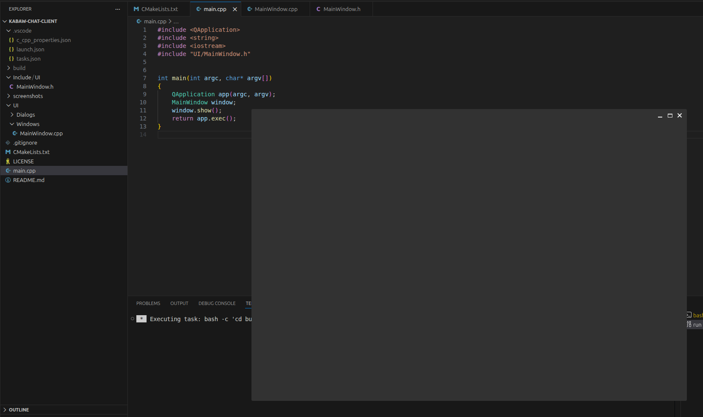
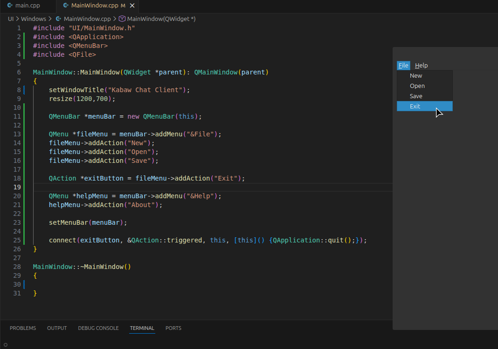
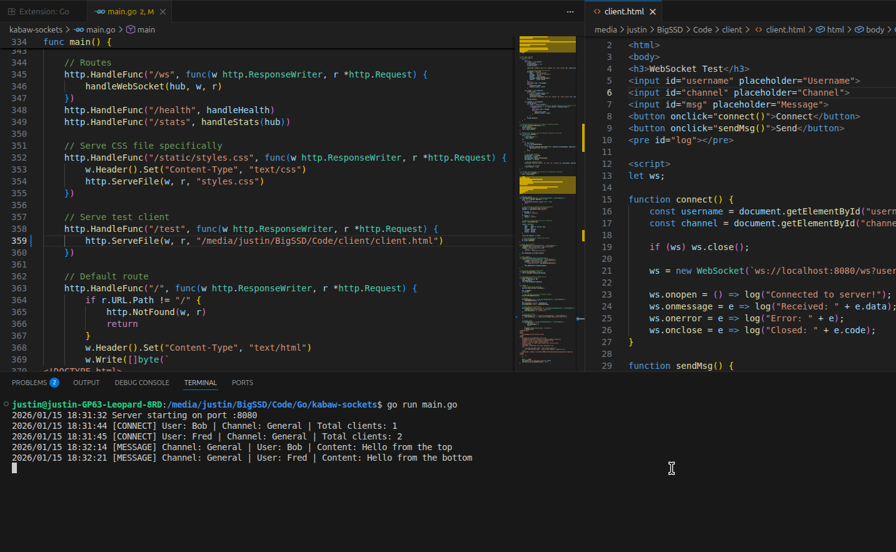
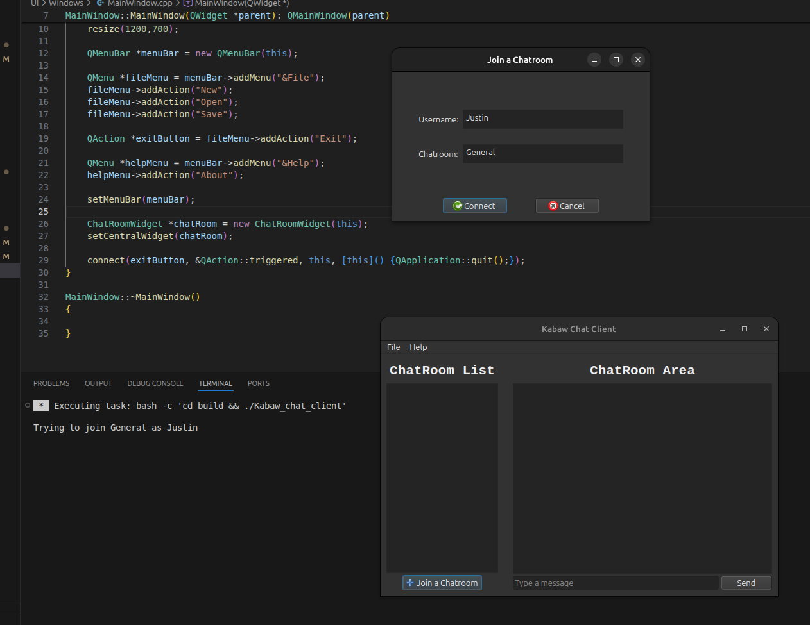
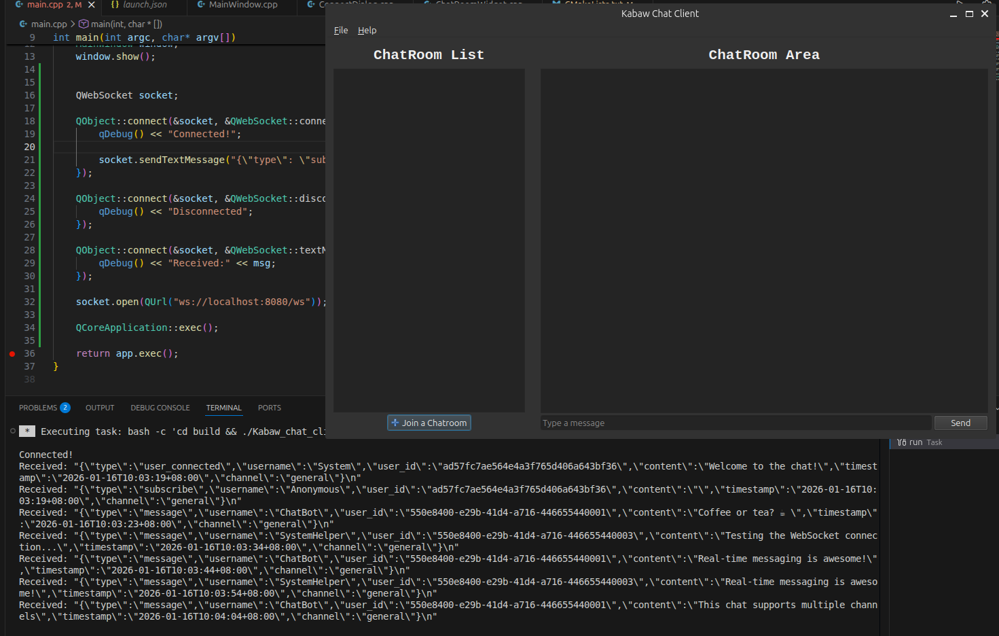
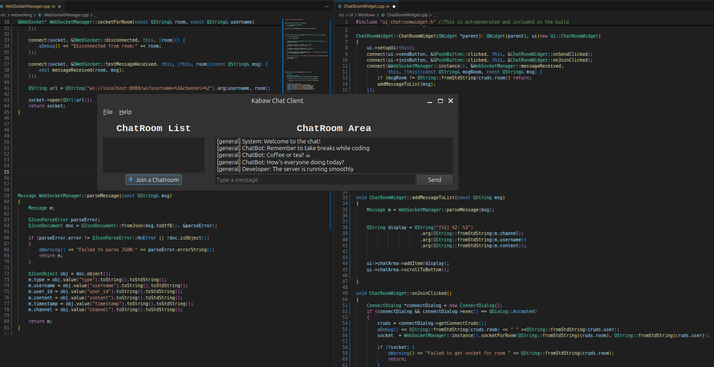
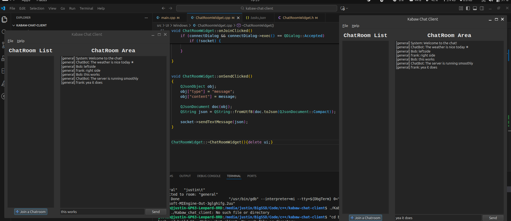
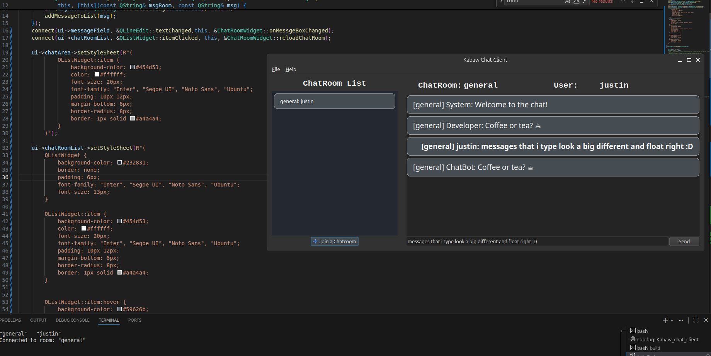

# Kabaw Chat Client
A simple WebSocket chat client built in Qt (C++) using the [kabaw-sockets](https://github.com/kabaw-ai/kabaw-sockets) backend.

---

## Project Structure
kabaw-chat-client/  
├── README.md  
├── LICENSE  
├── .gitignore  
├── Include # c++ header files  
├── src # Qt/C++ source files  
├── build/ # CMake build directory  
└── screenshots/ # Progress images  

# Progress / Screenshots

| Step | Screenshot | Description |
|------|-----------|-------------|
| 1    |  | Minimal Qt window opens |
| 2    |  | menu bar with working exit button |
| 3    |  | simple html client page |
| 4    |  | two connections sending messages |
| 5    |  | ui for chatroom and join dialog box |
| 6    |  | receving messages from server via QWebSocket |
| 7    |  | Left: Connects to WebSocket server with username, channel and sets up connection, waiting for received messages.emits messageReceived when we get a message from the server. json messages from server are parsed into a custom Message Object.     Right: set up the connection listen for the emitted signal, then we pass the message to addMessageToList and calling parseMessage before displaying it on the UI |
| 8    |  | Simply two clients both connected to the same channel, both in communication|
| 9    |  | Personal Messages show up brighter and on the right side only, added css for the qlistwidget and items. Visited channels will be saved and rejoined with just a click |
 
> More updates will be added as development progresses.

---

## License

This project is licensed under the MIT License. See [LICENSE](LICENSE) for details.